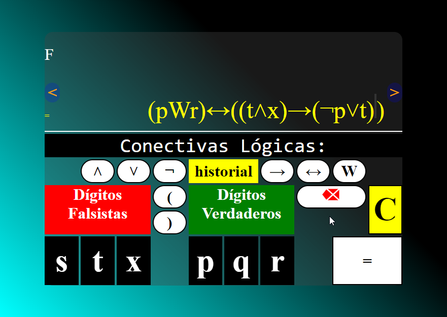

# Codevelp Propositional Calculator

Esta es una calculadora **lógica proposicional**, es
capas de hacer operaciones que son:

* Negación lógica (operador monádico, como el NOT).
* Conjunción lógica (AND).
* Disyunción lógica (OR).
* Implicación material (IF...THEN).

*Los operadores Bicondicional o doble implicación y disyunción exclusiva fueron excluidas en esta versión **1.2.3** por motivos importantes de incumplimiento del sistema lógico de esta calculadora, pero talvés posteriormente lo soporte.*

Se tiene la perspectiva de que esta calculadora sea la mejor calculadora proposicional del mundo

> No hacer comclusiones para encontrar o actualizar nuestra
lógica en como vemos la verdad  
-- Neverneit Sober
